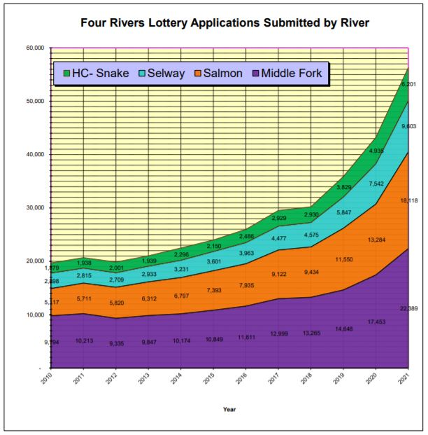

# riverLottery
Machine learning regression models to predict river trip permit lottery success.

# Concept
The most popular river trips in the USA are controlled by annual lotteries to determine who gets to float down that river. Thousands of applicants apply each year for just a handful of available trip launches per day in the spring - late summer season.

This project seeks to identify the days in a coming year where likelihood of lottery success is greatest for the Idaho Four Rivers Lottery system. 

### Rivers Modeled:

* Middle Fork Salmon
* Main Salmon
* Selway
* Hells Canyon Snake River

# Models

## Predict Applicants in Future Years
This prediction is necessary to use the probability model. It uses application data from 2010-2021 to predict the number of applicants to be expected to apply for each day of the season. The number of applicants is on an increasing trend:

## Lottery Success Probability
This model uses year, week, weekday, number of available permits, number of other applicants, and number of your group of friends who will apply for the same day to calculate a liklihood of winning a river trip permit.

# Data Sources

The following data source was used for this project. 

[Lottery Applications Historical Results](https://www.fs.usda.gov/detail/scnf/passes-permits/recreation/?cid=stelprdb5448165)

The Excel files of past lottery statistics were downloaded, and then processed in the `dataSetup.R` script.

***Note: Some of the Excel sheets had review comments in them, preventing reading the sheets into R. These comments were removed by hand. All other data manipulation is recorded in `dataSetup.R`***

## Data Cleanup

* Data from all rivers for all years available were complied into a single dataframe.

* Dataframe was replicated and stacked to add cases for 1-10 people applying for the same day at a time.

# References

